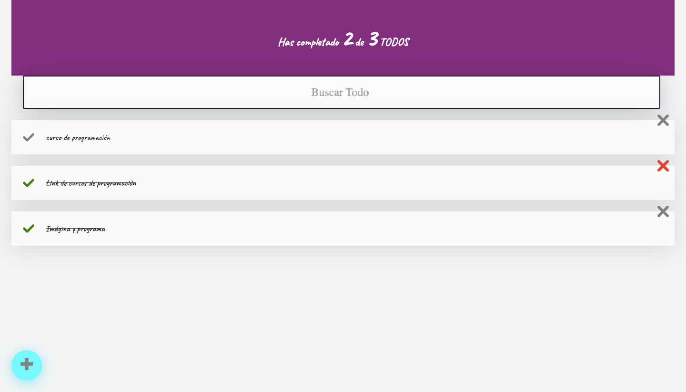

# Agregar, seleccionar y eliminar tareas con React


### para clonar el proyecto
```bash
git clone git@github.com:emersonxinay/todos_con_react.git
```
```bash
cd todo_con_react_main
```
### para levantar el proyecto
```bash
npm start
```
# para deploy
### `npm run build`
```bash
npm run build
```
### instalar herramiento para deploy
```bash
npm i --save-dev gh-pages
```
### para deployarlo 
```bash
npm run deploy
```

## url del proyecto final 
https://emersonxinay.github.io/todos_con_react/


